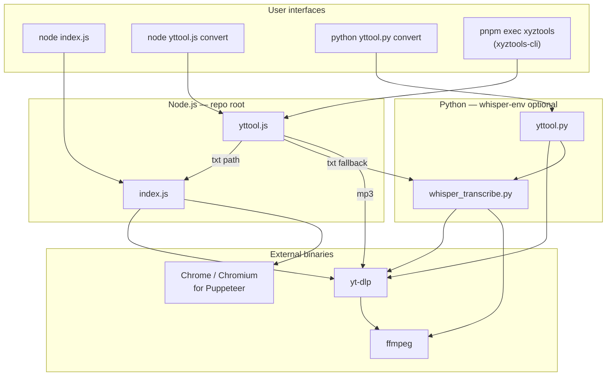

# Architecture — YouTube transcript extractor & tools

This document describes how the repository works as a system: programs, data flow, external tools, and dependencies. It complements the root [README.md](../README.md).

## 1. Purpose (one paragraph)

The project downloads or reads YouTube content locally and produces **text transcripts** (from captions when possible, from Whisper when not) and/or **MP3 audio** (single video or playlist). Everything is oriented around **local execution** and an `output/` directory (by default under the **current working directory** for Node tools, and under the **repo root** for `whisper_transcribe.py`).

## 2. System overview

## 3. Major components

| Artifact | Role |
|----------|------|
| **index.js** | Caption-first transcript pipeline: multiple strategies (libraries → yt-dlp subtitles → Puppeteer browser UI). Writes under `process.cwd()/output` when saving. |
| **whisper_transcribe.py** | Audio download via yt-dlp, transcription via **openai-whisper** or **faster-whisper**, writes next to repo `output/`. |
| **yttool.js** | Node orchestrator: MP3 single, MP3 playlist, or `txt` (delegates to `index.js` then Whisper). Exports library API when imported; runs CLI when executed as main. |
| **yttool.py** | Python twin of unified convert (MP3 / playlist / transcript). |
| **xyztools-cli/** | React Ink UI: URL + multi-select actions; sets `YTTOOL_ROOT` and calls `yttool.js` exports. Built to `dist/cli.mjs` (thin bundle, Node deps external). |
| **setup.sh** / **fix_whisper_install.sh** | Bootstrap `whisper-env`, Python 3.12, pip packages. |
| **whisper_manager.py** | Optional helper for managing Whisper models (see README). |

## 4. Transcript pipeline (`index.js`)

Order of attempts (see also [TRANSCRIPT_METHODS.md](../TRANSCRIPT_METHODS.md) if present):

1. **@treeee/youtube-caption-extractor** — improved caption fetch.
2. **youtube-transcript** — legacy package.
3. **yt-dlp** — download VTT/SRT without full video; parse to segments.
4. **Puppeteer** — drive YouTube in a headless browser and scrape the transcript panel.

**Puppeteer launch:** prefers `PUPPETEER_EXECUTABLE_PATH`, then common OS Chrome/Chromium paths, then `channel: 'chrome'` so a **system-installed Chrome** can be used when Puppeteer’s downloaded browser is missing (common under pnpm without install scripts).

**CLI flags (high level):** `--format` (text, timestamped, srt, json), `--output`, `--print`, `--save` (default save to `output/`), `--lang`, `--whisper` (stub / redirect to Python).

## 5. Audio / MP3 pipeline (`yttool.js` / `yttool.py`)

- Requires **yt-dlp** on `PATH`.
- Single file: `yt-dlp -x --audio-format mp3 …` with templated filename under `getOutputDir()` → `cwd/output`.
- Playlist: `yt-dlp` with playlist template `output/%(playlist)s/%(title)s.%(ext)s`.

## 6. Whisper pipeline (`whisper_transcribe.py`)

- Uses **yt-dlp** (Python module) to fetch best audio, **ffmpeg** (via yt-dlp postprocessor) for WAV.
- **openai-whisper** preferred on Apple Silicon (MPS when available); **faster-whisper** as alternate.
- Output directory: `dirname(script)/output` (repo-relative, not `cwd`).

## 7. `xyztools-cli` architecture

| Piece | Responsibility |
|-------|------------------|
| `src/bootstrap.jsx` | Resolves repo root (`…/xyztools-cli` → parent of parent), sets `process.env.YTTOOL_ROOT`, dynamic `import()` of `yttool.js`, renders Ink app, waits until work completes. |
| `src/App.jsx` | Wizard: intro → URL (`ink-text-input`) → multi-select (`CheckboxMultiSelect`) → confirm → sequential `convertToMp3` / `convertPlaylistToMp3` / `convertToTxt`. |
| Build | `esbuild` ESM + `--packages=external` → small `dist/cli.mjs` that relies on hoisted/workspace `node_modules`. |

**Important:** `yttool.js` uses `getOutputDir()` = `path.join(process.cwd(), 'output')`. If you run `xyztools` from `xyztools-cli/`, files land in **`xyztools-cli/output`**, not the repo root. Run from the repository root (or `cd` there first) if you want a single shared `output/` next to `index.js`.

## 8. Dependencies

### 8.1 Root `package.json` (pnpm workspace package `youtube-transcript-extractor`)

| Package | Use |
|---------|-----|
| `@treeee/youtube-caption-extractor` | Primary caption API attempt |
| `youtube-transcript` | Fallback caption fetch |
| `puppeteer` | Browser transcript method |
| `yargs` | CLI parsing (`index.js`, `yttool.js`) |
| `chalk` | Terminal styling |
| **dev:** `xyztools-cli` (`workspace:*`) | Exposes `xyztools` binary via `pnpm exec xyztools` from root |

**System / not in package.json:** `node` ≥ 18, **yt-dlp**, **ffmpeg** (for audio extract / thumbnails), **Google Chrome** (or Chromium) for Puppeteer when bundled Chrome is absent.

### 8.2 `xyztools-cli/package.json`

| Package | Use |
|---------|-----|
| `ink`, `react`, `ink-text-input` | Terminal UI |
| `react-devtools-core` | Peer of Ink; required for bundling when deps are inlined (externalized in current build) |
| `esbuild`, `tsx` | Build and dev |

### 8.3 Python (`whisper-env` recommended)

| Package | Use |
|---------|-----|
| `openai-whisper` or `faster-whisper` | ASR |
| `yt-dlp` | Download audio |

**System:** Python **3.12.x** (project README stresses incompatibility with 3.13+ for some stacks), **ffmpeg**.

## 9. Environment variables

| Variable | Effect |
|----------|--------|
| **YTTOOL_ROOT** | Absolute path to repo root; `yttool.js` resolves `index.js`, `whisper_transcribe.py`, `whisper-env` from here. Set by `xyztools-cli` bootstrap. |
| **PUPPETEER_EXECUTABLE_PATH** | Optional explicit browser binary for Puppeteer. |

## 10. Output and git hygiene

- **Node tools** default to `./output` relative to **current working directory**.
- **whisper_transcribe.py** uses **`output/` beside the script** (repo root).
- `.gitignore` excludes `output/`, media artifacts, `node_modules/`, `whisper-env/`, and `xyztools-cli/dist/`.

## 11. Failure modes (architectural)

- **YouTube caption APIs** often fail in 2024–2026; design assumes Whisper fallback.
- **Puppeteer** needs a real browser binary if pnpm skipped Puppeteer’s browser download.
- **Whisper** must be installed inside the venv used by `whisper_transcribe.py`; otherwise the `txt` path errors after `index.js` fails.

## 12. Extension points

- Add new export modes in `index.js` (`formatTranscript` / yargs choices).
- Add new `yttool.js` operations and surface them in `xyztools-cli` `OPTION_DEFS`.
- Add transcript methods in `getTranscript` method list in `index.js`.

## 13. Desktop app (`xyztoolsapp/`)

Tauri + React UI that spawns `node <repo>/yttool.js convert …` with `YTTOOL_ROOT` and user-chosen output parent as `cwd`. Whisper model weights can be cached under an app-local directory (`dirs::data_local_dir()/xyztoolsapp/whisper-models`) via `WHISPER_DOWNLOAD_ROOT` / `whisper_transcribe.py --cache-dir`. See [XYZTOOLSAPP.md](./XYZTOOLSAPP.md) and `xyztoolsapp/docs/BUILD.md`.

---

*Generated for maintainers. User workflows and copy-paste commands stay in [README.md](../README.md).*
