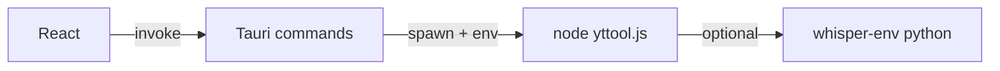

# XYZTools desktop — architecture

## Layers

1. **React UI** (`xyztoolsapp/src/`) — URL, output folder picker (Tauri dialog), checkboxes (MP3 / playlist / transcript), Whisper model + prefetch, log view listening to `job-log` events.
2. **Tauri / Rust** (`xyztoolsapp/src-tauri/`) — `pick_output_folder`, `whisper_models_dir`, `prefetch_whisper_model`, `run_conversion`. Spawns `node repo/yttool.js convert …` with `cwd` = user-selected parent directory so `output/` is created **next to** that choice (same semantics as CLI).
3. **Existing toolkit** (repo root) — `yttool.js` → `index.js` / `whisper_transcribe.py`, unchanged contract.

## Data flow

## Why not bundle Node?

Shipping a full Node + `node_modules` inside the `.app` is possible but heavy. This MVP expects **system `node`** (same as local development). A future iteration can add a **sidecar** `node` or compile critical paths to native code.

## Release layout

Built bundles are produced by Cargo/Tauri under `src-tauri/target/release/bundle/`. Human-facing copies for GitHub Releases live in the repo **`release/`** directory (see `release/README.md`).
